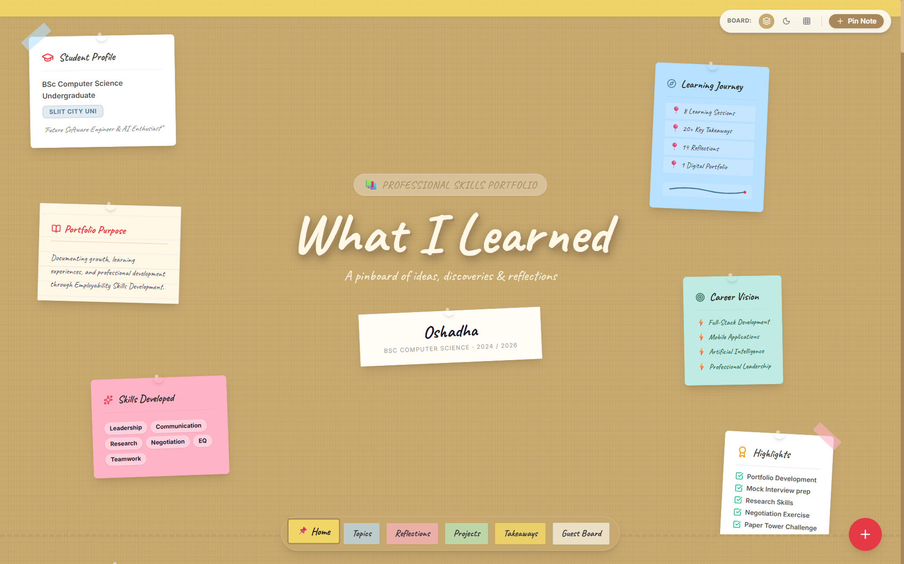

# Hey there, I'm Oshadha 👋

### **Full-stack by passion, AI by curiosity, engineering by mindset.**

Building software that is scalable, maintainable, and designed for real-world impact.

  

---

# 👋 About Me

I'm **Oshadha**, a Computer Science undergraduate and software engineer passionate about building software that solves real-world problems.

I enjoy engineering systems from the ground up—whether it's an enterprise web application, a desktop application, a mobile experience, or experimenting with AI-powered solutions.

I believe great software isn't just about writing code—it's about building systems that are scalable, maintainable, intuitive, and enjoyable to use.

When I'm not coding, you'll usually find me learning new technologies, refining software architecture, or exploring how AI can improve modern applications.

---

# 🚀 What I'm Building

Currently focused on

- 🌐 Enterprise Full-Stack Web Applications
- 📱 Mobile Applications
- 💻 Desktop Applications
- 🤖 AI & Machine Learning
- ☁ Cloud-native Applications
- 🏗 Software Architecture & System Design

---

# 🛠 Tech Stack

## Languages

 

JavaScript • TypeScript • Python • Java • C# • PHP • C++ • Dart • SQL

---

## Frontend

 

React • HTML5 • CSS3 • Tailwind CSS • Bootstrap

---

## Backend

 

Node.js • Express.js • ASP.NET Core • REST APIs

---

## Frameworks

 

.NET • ASP.NET Core • Flutter

---

## Databases

 

MongoDB • MySQL • PostgreSQL • Supabase

---

## Cloud & DevOps

 

Docker • AWS • GitHub Actions • Cloudflare • Cloudflare R2

---

## Tools

 

Git • GitHub • VS Code • Postman • Figma

---

## Currently Exploring

- Artificial Intelligence
- Machine Learning
- Cloud Computing
- System Design

---

# 📂 Featured Projects

> *Three projects. Three engineering challenges.*

| 🚀 Project One | 💡 Project Two | ⚡ Project Three |
|:---:|:---:|:---:|
|  |  |  |
| **PS-Portfolio** | **Project Name** | **Project Name** |
| A highly interactive, full-stack personal portfolio featuring a digital "Notes Board" with fluid animations and serverless infrastructure. | Short project description goes here. | Short project description goes here. |
| **Tech:** React 19 • Vite • Tailwind CSS v4 • Framer Motion • Express.js • REST API • Vercel  | **Tech:** Flutter • Firebase | **Tech:** ASP.NET Core • SQL Server |
| [🔗 Repository](https://github.com/Oshadha369/PS-Portfolio) [🌐 Live Demo](psportfolio-tan.vercel.app) | [🔗 Repository](PROJECT_2_REPO) [🌐 Live Demo](PROJECT_2_DEMO) | [🔗 Repository](PROJECT_3_REPO) [🌐 Live Demo](PROJECT_3_DEMO) |

---

# 📊 Quick Stats

---

## 🚀 Let's Build Something

---

### Thanks for stopping by 👋

*"Always learning. Always building. Always improving."*

